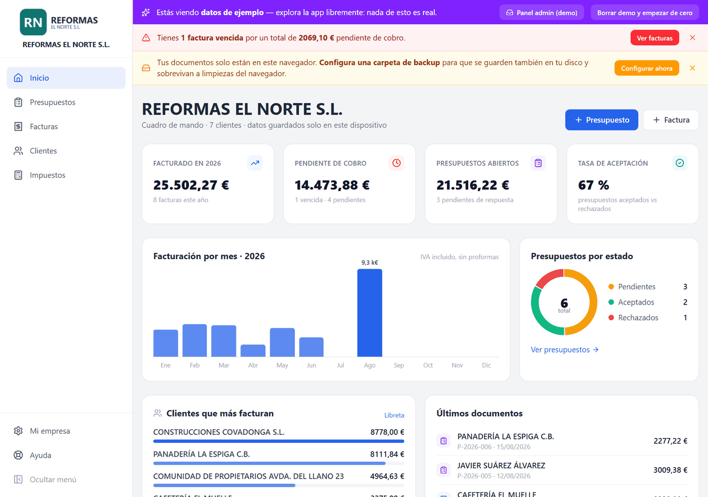
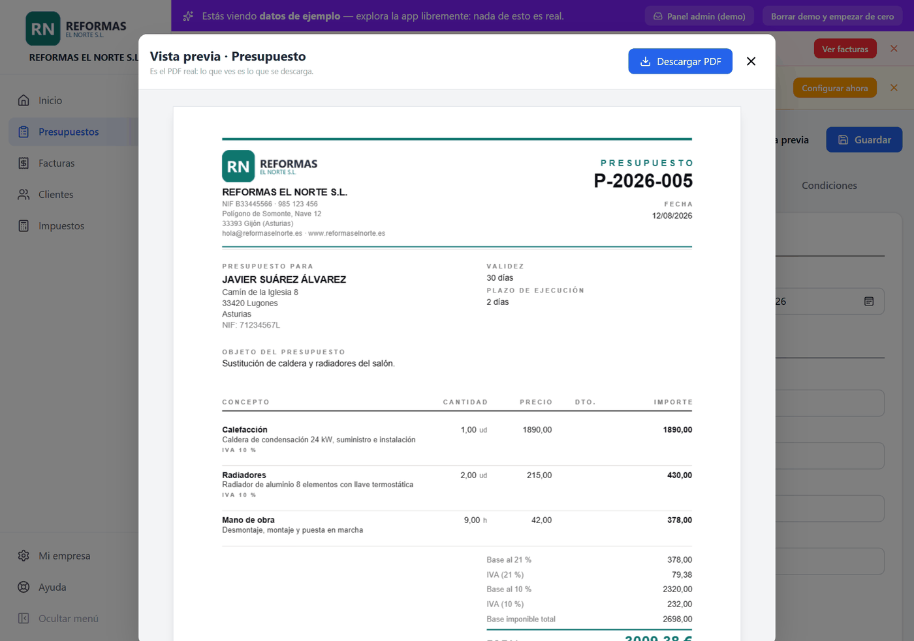
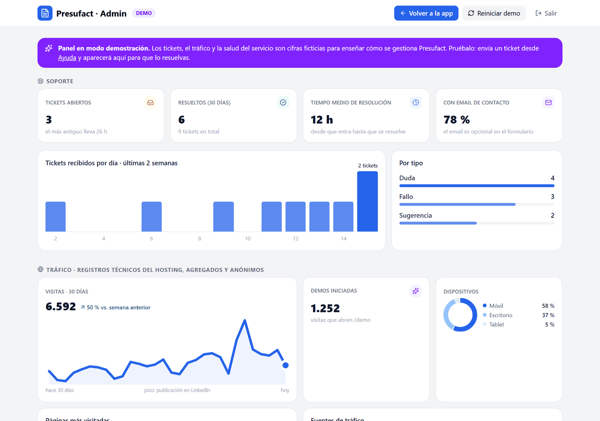

<div align="center">

# Presufact

**Presupuestos y facturas profesionales en PDF — gratis, sin registro y 100 % local.**

[](https://github.com/denislcian/presufact/actions/workflows/ci.yml)


🌐 **[presufactu.vercel.app](https://presufactu.vercel.app)** · 🧪 **[Demo con datos de ejemplo](https://presufactu.vercel.app/demo)** · 🛠️ **[Panel de administración (demo)](https://presufactu.vercel.app/admin?demo=1)**



</div>

---

Presufact es una aplicación web para autónomos y pequeños negocios en España: crea **presupuestos con firma de aceptación del cliente** y borradores de factura con IVA e IRPF, sin crear cuenta y sin que los datos salgan del dispositivo. **No hay servidor de datos**: todo vive en el navegador (IndexedDB) y en las copias de seguridad que el usuario decide hacer.

La web funciona como **landing + demo**: [`/demo`](https://presufactu.vercel.app/demo) carga una empresa ficticia (11 facturas, 6 presupuestos —dos firmados—, 7 clientes y dos ejercicios fiscales) para explorar toda la app sin rellenar nada. Se borra con un clic y nunca pisa datos reales.

## Qué hace

| | |
|---|---|
| 📊 **Cuadro de mando** | Facturado del año, pendiente de cobro (con vencidas), presupuestos abiertos, tasa de aceptación, facturación por mes, top clientes y últimos documentos — calculado al instante en el dispositivo con gráficos propios, sin librerías. |
| 📋 **Presupuestos con firma** | Condiciones, validez, plazo de ejecución y firma de aceptación del cliente dibujada en pantalla (o subida como imagen); la firma se incrusta en el PDF. Conversión a factura en un clic. |
| 🧾 **Facturas en PDF** | Multi-IVA por línea (21/10/4/0 %), retención de IRPF, recargo de equivalencia, inversión del sujeto pasivo, descuentos, proformas y rectificativas (serie R). |
| 🎨 **PDF editorial** | Diseño propio generado con jsPDF, con logo y color de marca. La **vista previa es el PDF real** renderizado con pdf.js: lo que se ve es lo que se descarga. |
| 📥 **Importador de PDF** | Reimporta los documentos generados por Presufact con exactitud (round-trip completo, multi-IVA incluido) y extrae datos aproximados de PDFs de otros programas. |
| 👥 **Clientes y cobros** | Libreta con autocompletado, estados de cobro, aviso de facturas vencidas, importación CSV. |
| 📈 **Resumen fiscal** | Desglose por trimestres orientado a los modelos 303/130, CSV, y "ZIP gestoría" con todos los PDFs del año. |
| 📤 **Facturae XML** | Exportación al formato de factura electrónica española (firma con AutoFirma a cargo del usuario). |
| 📱 **PWA** | Instalable en escritorio y móvil; funciona completamente sin conexión. |
| 💾 **Copias de seguridad** | Automáticas, en una carpeta local (incluida la propia nube del usuario: OneDrive, Drive, Dropbox), con historial restaurable. |
| 🎫 **Soporte y panel de admin** | Formulario de tickets con buzón serverless y panel `/admin` con KPIs de soporte, bandeja con filtros y, en modo demo, tráfico agregado y salud del servicio (cifras ficticias, etiquetadas como tales). |

<div align="center">

<br><sub>La vista previa genera el PDF con el mismo código que la descarga y lo pinta con pdf.js.</sub>
<br><br>

</div>

## Privacidad y seguridad

- **Sin servidor de datos**: presupuestos, facturas y clientes se guardan en IndexedDB, en el dispositivo del usuario. Sin cuentas, sin email, sin analítica, sin cookies de rastreo.
- **CSP estricta** (`default-src 'self'`), HSTS, `X-Frame-Options: DENY` y cero dependencias externas en tiempo de ejecución (ni CDNs ni fuentes de terceros). En modo avión la app funciona entera.
- `npm audit --omit=dev`: 0 vulnerabilidades (se comprueba en CI).
- La única excepción, explicada en la [política de privacidad](https://presufactu.vercel.app/privacidad): el formulario opcional de soporte, que envía el ticket a un buzón para poder responder (el email se borra al resolverlo).

## Arquitectura

| Capa | Tecnología |
|---|---|
| UI | React 19 + Vite + Tailwind CSS 4 |
| Datos | Dexie (IndexedDB), 100 % en el dispositivo |
| PDF | jsPDF (generación) + pdfjs-dist (importación y vista previa) |
| Soporte | Vercel Serverless Function + Upstash Redis (solo el buzón de tickets) |
| Hosting | Vercel (estático; deploy automático desde `main`) |
| Calidad | ESLint 9 (flat config), Vitest, GitHub Actions |

```
src/
├── pages/            landing, landings SEO, comparativa, guía Verifactu, ayuda, demo, admin
├── components/       app: cuadro de mando, editor, listados, clientes, impuestos, ajustes, gráficos
├── utils/
│   ├── formatters.js  motor fiscal (multi-IVA, IRPF, RE, ISP) — con tests
│   ├── numbering.js   numeración por series y años — con tests
│   ├── pdfGenerator.js / pdfImporter.js   PDF: generación y round-trip
│   ├── backup.js      copias locales, carpeta/nube, historial
│   ├── facturae.js    Facturae 3.2 XML
│   └── demoData.js / adminDemo.js   datos de demostración
├── db.js             esquema Dexie y CRUD
└── AppLayout.jsx     sidebar, banners y onboarding (chunk diferido)
api/tickets.js        buzón de soporte (serverless)
```

Decisiones de ingeniería de las que estoy orgulloso:

- **Round-trip de PDF**: el importador reconstruye un documento a partir del PDF con anclajes posicionales (mm→pt), fusión de etiquetas con `charSpace` y recuperación del tipo de IVA por línea — importar un PDF propio reproduce el documento exacto.
- **Motor fiscal testado**: cálculo por grupos de tipo impositivo con herencia por línea, IRPF sobre base (con inversión de signo en rectificativas) y desglose por tipo; numeración que respeta series (`2026-0010`, `P-2026-007`, `R-0001`) y abre serie nueva cada enero. `npm test`: 22 casos adversariales.
- **Vista previa = PDF real**: en vez de mantener un segundo diseño en HTML que acabe divergiendo, la vista previa genera el PDF y lo renderiza con pdf.js.
- **Carga diferida**: la landing pesa ~98 KB gzip; la app (Dexie, jsPDF, pdf.js), el panel de admin y la demo se cargan en chunks separados solo cuando se entra en ellos.
- **Soporte sin traicionar la privacidad**: endpoint serverless con rate-limit por IP hasheada, comparación de token en tiempo constante y panel protegido en el servidor; en la demo, los tickets se guardan localmente y aparecen en el panel de demostración.

## Desarrollo

```bash
npm install
npm run dev      # http://localhost:5173
npm test         # vitest
npm run lint     # eslint
npm run build    # producción en dist/
```

Para activar el buzón de soporte real hay que definir en Vercel `UPSTASH_REDIS_REST_URL`, `UPSTASH_REDIS_REST_TOKEN` y `ADMIN_TOKEN`; sin ellas, `/api/tickets` responde 503 y la app lo indica.

## Contribuir

Las sugerencias y los fallos se agradecen: abre una [incidencia](https://github.com/denislcian/presufact/issues) contando qué hacías y qué esperabas (sin datos reales de clientes, por favor), o usa el [formulario de soporte](https://presufactu.vercel.app/ayuda) de la web.

## Aviso legal

Presufact genera **presupuestos, proformas y borradores de factura** — documentos no sujetos al reglamento Verifactu. La obligación de software de facturación certificado (Verifactu) para la facturación oficial entra en vigor el 1/1/2027 (sociedades) y el 1/7/2027 (autónomos): consulta la [guía Verifactu](https://presufactu.vercel.app/verifactu) y habla con tu gestor para tu caso concreto.

---

Desarrollado por [Denis Lucian Morar](https://github.com/denislcian) · Gijón, Asturias
