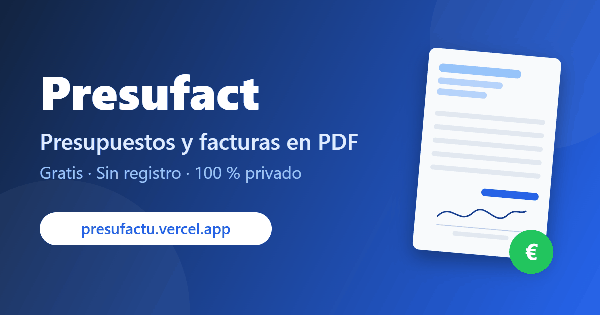

# Presufact



**Presupuestos y facturas profesionales en PDF — gratis, sin registro y 100 % local.**

🔗 **Pruébalo:** [presufactu.vercel.app](https://presufactu.vercel.app)

Presufact es una aplicación web para autónomos y pequeños negocios en España: crea presupuestos con firma de aceptación del cliente y borradores de factura con IVA e IRPF, sin crear cuenta y sin que tus datos salgan de tu dispositivo. No hay servidor de datos: todo vive en tu navegador.

## Características

- 📋 **Presupuestos con firma** — condiciones, validez y firma de aceptación del cliente dibujada en pantalla (o subida como imagen). Conversión a factura en un clic.
- 🧾 **Facturas en PDF** — multi-IVA por línea (21/10/4/0 %), retención de IRPF, recargo de equivalencia, inversión del sujeto pasivo, descuentos y rectificativas (serie R).
- 🎨 **PDF profesional** — diseño editorial propio generado con jsPDF, con tu logo y tu color de marca. Sin marcas de agua.
- 📥 **Importador de PDF** — reimporta documentos generados por Presufact con exactitud (round-trip completo, multi-IVA incluido) y extrae datos aproximados de PDFs de otros programas.
- 👥 **Clientes y cobros** — libreta de clientes con autocompletado, estados de cobro (pendiente → enviada → cobrada), aviso de facturas vencidas.
- 📊 **Resumen fiscal** — desglose por trimestres orientado a los modelos 303/130 y exportación CSV; desde Facturas, "ZIP gestoría" con todos los PDFs del año y su desglose.
- 📤 **Facturae XML** — exportación al formato de factura electrónica española (firma con AutoFirma a cargo del usuario).
- 📱 **PWA** — instalable en escritorio y móvil; funciona completamente sin conexión.
- 💾 **Copias de seguridad** — automáticas, en la carpeta local que elijas (incluida tu propia nube: OneDrive, Drive, Dropbox) e historial restaurable.
- 🧪 **Modo demo** — datos de ejemplo con un clic para probar la app sin rellenar nada.

## Privacidad y seguridad

- **Sin servidor de datos**: facturas, presupuestos y clientes se guardan en IndexedDB, en el dispositivo del usuario. No hay cuentas, ni email, ni analítica, ni cookies de rastreo.
- **CSP estricta** (`default-src 'self'`), HSTS, `X-Frame-Options: DENY` y cero dependencias externas en tiempo de ejecución (ni CDNs ni fuentes de terceros). Puedes comprobarlo en modo avión: la app funciona entera.
- **`npm audit`: 0 vulnerabilidades** conocidas a fecha de la última versión.
- La única excepción, explicada en la [política de privacidad](https://presufactu.vercel.app/privacidad): el formulario opcional de soporte, que envía el ticket a un buzón para poder responder.

## Stack y arquitectura

| Capa | Tecnología |
|---|---|
| UI | React 19 + Vite + Tailwind CSS 4 |
| Datos | Dexie (IndexedDB), 100 % en el dispositivo |
| PDF | jsPDF (generación con diseño propio) + pdfjs-dist (importación) |
| Soporte | Vercel Serverless Function + Upstash Redis (solo el buzón de tickets) |
| Hosting | Vercel (archivos estáticos; deploy automático desde `main`) |

Detalles de ingeniería de los que estoy orgulloso:

- **Round-trip de PDF**: el importador reconstruye un documento a partir del PDF usando anclajes posicionales (mm→pt) y fusión de etiquetas con `charSpace`, con recuperación del tipo de IVA por línea — importar un PDF propio reproduce el documento exacto, multi-IVA incluido.
- **Motor fiscal**: cálculo por grupos de tipo impositivo con herencia por línea, IRPF sobre base (con inversión de signo en rectificativas) y desglose por tipo cubierto por una batería de tests adversariales (`npm test`).
- **Buzón de soporte sin traicionar la privacidad**: endpoint serverless con rate-limit por IP (hasheada), comparación de token en tiempo constante y panel de administración protegido en el servidor.

## Desarrollo

```bash
npm install
npm run dev      # desarrollo
npm run build    # producción (dist/)
```

## Aviso legal

Presufact genera **presupuestos, proformas y borradores de factura** — documentos no sujetos al reglamento Verifactu. La obligación de software de facturación certificado (Verifactu) para la facturación oficial entra en vigor el 1/1/2027 (sociedades) y el 1/7/2027 (autónomos): consulta la [guía Verifactu](https://presufactu.vercel.app/verifactu) y habla con tu gestor para tu caso concreto.

---

Desarrollado por [@denislcian](https://github.com/denislcian) · ¿Sugerencias o fallos? [Abre una incidencia](https://github.com/denislcian/presufact/issues) o usa el [formulario de soporte](https://presufactu.vercel.app/ayuda).
